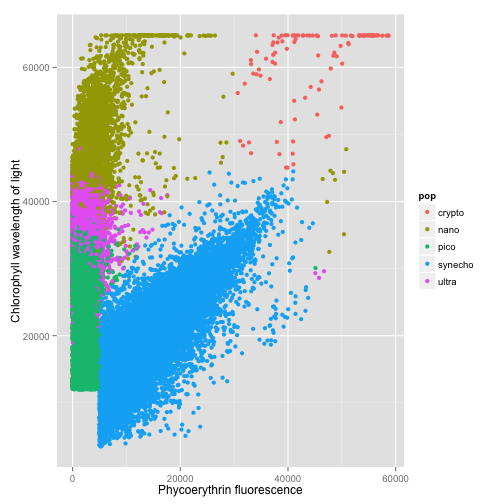
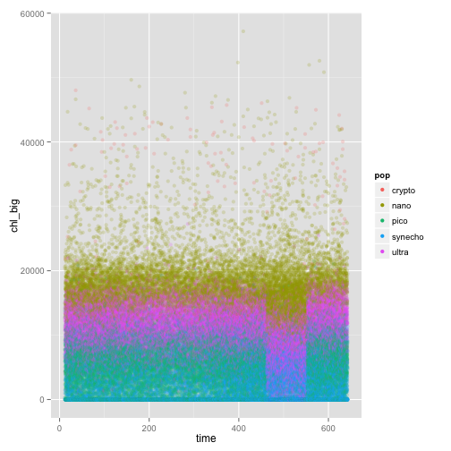
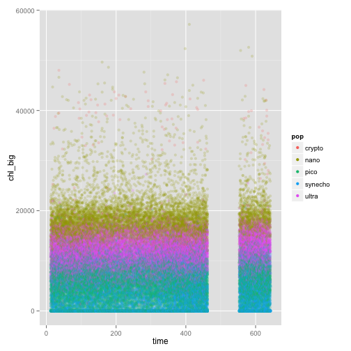

R Assignment: Classification of Ocean Microbes
========================================================

## Step 1: Read and summarize the data
Read and summarize the data

```r
data <- read.csv("seaflow_21min.csv")
summary(data)
```

```
##     file_id         time        cell_id            d1       
##  Min.   :203   Min.   : 12   Min.   :    0   Min.   : 1328  
##  1st Qu.:204   1st Qu.:174   1st Qu.: 7486   1st Qu.: 7296  
##  Median :206   Median :362   Median :14995   Median :17728  
##  Mean   :206   Mean   :342   Mean   :15008   Mean   :17039  
##  3rd Qu.:208   3rd Qu.:503   3rd Qu.:22401   3rd Qu.:24512  
##  Max.   :209   Max.   :643   Max.   :32081   Max.   :54048  
##        d2          fsc_small        fsc_perp        fsc_big     
##  Min.   :   32   Min.   :10005   Min.   :    0   Min.   :32384  
##  1st Qu.: 9584   1st Qu.:31341   1st Qu.:13496   1st Qu.:32400  
##  Median :18512   Median :35483   Median :18069   Median :32400  
##  Mean   :17437   Mean   :34919   Mean   :17646   Mean   :32405  
##  3rd Qu.:24656   3rd Qu.:39184   3rd Qu.:22243   3rd Qu.:32416  
##  Max.   :54688   Max.   :65424   Max.   :63456   Max.   :32464  
##        pe          chl_small        chl_big           pop       
##  Min.   :    0   Min.   : 3485   Min.   :    0   crypto :  102  
##  1st Qu.: 1635   1st Qu.:22525   1st Qu.: 2800   nano   :12698  
##  Median : 2421   Median :30512   Median : 7744   pico   :20860  
##  Mean   : 5325   Mean   :30164   Mean   : 8328   synecho:18146  
##  3rd Qu.: 5854   3rd Qu.:38299   3rd Qu.:12880   ultra  :20537  
##  Max.   :58675   Max.   :64832   Max.   :57184
```

### Question 1
**How many particles labeled "synecho" are in the file provided?**

```r
summary(data$pop)["synecho"]
```

```
## synecho 
##   18146
```

### Question 2
**What is the 3rd Quantile of the field fsc_small?**

```r
summary(data$fsc_small)["3rd Qu."]
```

```
## 3rd Qu. 
##   39200
```

## Step 2: Split the data into test and training sets
Division of the data into two equal subsets, one for training and one for testing, in an unbiased manner.

```r
library(caret)
```

```
## Warning: package 'caret' was built under R version 3.1.1
```

```
## Loading required package: lattice
## Loading required package: ggplot2
```

```r
##Set seed, so results can be reproducible
set.seed(123)

## Create partition based on the pop column of the dataset, with 50% of the data going into training
aux <- createDataPartition(data$pop, p=0.5, list = FALSE)

## Training set
train <- data[aux,]

## Test set
test <- data[-aux,]
```

### Question 3
**What is the mean of the variable "time" for your training set?**

```r
mean(train$time)
```

```
## [1] 340.8
```


## Step 3: Plot the data
Plot of **_pe_** against **_chl\_small_** colored by **_pop_**

```r
library(ggplot2)

ggplot(aes(x = pe, y = chl_small, color = pop), data = data) + geom_point() + ylab("Chlorophyll wavelength of light") + xlab("Phycoerythrin fluorescence")
```

 

### Question 4
**In the plot of pe vs. chl_small, the particles labeled ultra should appear to be somewhat "mixed" with two other populations of particles. Which two populations?**  
As can be observed in the plot, the answer is *pico* and *nano*

## Step 4: Train a decision tree.
Training a tree as a function of the sensor measurements: fsc\_small + fsc\_perp + fsc\_big + pe + chl\_big + chl\_small


```r
library(rpart)

##formula
fol <- formula(pop ~ fsc_small + fsc_perp + fsc_big + pe + chl_big + chl_small)

##Decision Tree model
model <- rpart(fol, method="class", data=train)

print(model)
```

```
## n= 36172 
## 
## node), split, n, loss, yval, (yprob)
##       * denotes terminal node
## 
##  1) root 36172 25740 pico (0.0014 0.18 0.29 0.25 0.28)  
##    2) pe< 5000 26339 15950 pico (0 0.22 0.39 0 0.38)  
##      4) chl_small< 3.253e+04 11763  2148 pico (0 0.00026 0.82 0 0.18) *
##      5) chl_small>=3.253e+04 14576  6591 ultra (0 0.4 0.053 0 0.55)  
##       10) chl_small>=4.13e+04 5204   670 nano (0 0.87 0.00019 0 0.13) *
##       11) chl_small< 4.13e+04 9372  2056 ultra (0 0.14 0.082 0 0.78) *
##    3) pe>=5000 9833   760 synecho (0.0052 0.054 0.0043 0.92 0.014)  
##      6) chl_small>=3.739e+04 647   133 nano (0.079 0.79 0 0.062 0.065) *
##      7) chl_small< 3.739e+04 9186   153 synecho (0 0.0015 0.0046 0.98 0.011) *
```

### Question 5
**Which populations, if any, is your tree incapable of recognizing?**  
The crypto population is not recognized by the tree, since it does not appear in any of the branches.

### Question 6
**What is the value of the threshold on the pe field learned in your model?**
The value is 5000 (can be seen on branch 2 and 3).

### Question 7
**Based on your decision tree, which variables appear to be most important in predicting the class population?**  
The variables *pe* and *chl_small*, since these are the only ones present in the tree.

## Step 5: Evaluate the decision tree on the test data.
Using the predict function to generate predictions on the test data, and compare these predictions with the class labels in the test data itself.


```r
testPred <- predict(model, newdata = test, type = "class")

confusionMatrix(testPred, test$pop)
```

```
## Confusion Matrix and Statistics
## 
##           Reference
## Prediction crypto nano pico synecho ultra
##    crypto       0    0    0       0     0
##    nano        51 5016    0      61   710
##    pico         0    4 9589       0  2237
##    synecho      0    6   55    9012    94
##    ultra        0 1323  786       0  7227
## 
## Overall Statistics
##                                         
##                Accuracy : 0.853         
##                  95% CI : (0.849, 0.856)
##     No Information Rate : 0.288         
##     P-Value [Acc > NIR] : <2e-16        
##                                         
##                   Kappa : 0.801         
##  Mcnemar's Test P-Value : NA            
## 
## Statistics by Class:
## 
##                      Class: crypto Class: nano Class: pico Class: synecho
## Sensitivity                0.00000       0.790       0.919          0.993
## Specificity                1.00000       0.972       0.913          0.994
## Pos Pred Value                 NaN       0.859       0.811          0.983
## Neg Pred Value             0.99859       0.956       0.965          0.998
## Prevalence                 0.00141       0.176       0.288          0.251
## Detection Rate             0.00000       0.139       0.265          0.249
## Detection Prevalence       0.00000       0.161       0.327          0.253
## Balanced Accuracy          0.50000       0.881       0.916          0.994
##                      Class: ultra
## Sensitivity                 0.704
## Specificity                 0.919
## Pos Pred Value              0.774
## Neg Pred Value              0.887
## Prevalence                  0.284
## Detection Rate              0.200
## Detection Prevalence        0.258
## Balanced Accuracy           0.811
```

### Question 8
**How accurate was your decision tree on the test data?**  
The decision tree on the test data showed an accuracy of 0.8527, as can be seen on the Confusion Matrix.

## Step 6: Build and evaluate a random forest.
Repeating the same methodology used for the evaluation of the decision tree, this time a random forest was generated.

```r
library(randomForest)
```

```
## Warning: package 'randomForest' was built under R version 3.1.1
```

```
## randomForest 4.6-10
## Type rfNews() to see new features/changes/bug fixes.
```

```r
##Random Forest model
modelRF <- randomForest(fol, method="class", data=train)

print(modelRF)
```

```
## 
## Call:
##  randomForest(formula = fol, data = train, method = "class") 
##                Type of random forest: classification
##                      Number of trees: 500
## No. of variables tried at each split: 2
## 
##         OOB estimate of  error rate: 7.8%
## Confusion matrix:
##         crypto nano  pico synecho ultra class.error
## crypto      49    1     0       1     0   0.0392157
## nano         1 5594     0       3   751   0.1189164
## pico         0    0 10097      14   319   0.0319271
## synecho      0    3     0    9070     0   0.0003307
## ultra        0  369  1352       8  8540   0.1683708
```

Confusion Matrix to evaluate the Random Forest model

```r
testPredRF <- predict(modelRF, newdata = test, type = "class")

confusionMatrix(testPredRF, test$pop)
```

```
## Confusion Matrix and Statistics
## 
##           Reference
## Prediction crypto  nano  pico synecho ultra
##    crypto      48     1     0       1     0
##    nano         2  5526     0       0   361
##    pico         0     0 10103       0  1408
##    synecho      1     3     9    9072     8
##    ultra        0   819   318       0  8491
## 
## Overall Statistics
##                                         
##                Accuracy : 0.919         
##                  95% CI : (0.916, 0.922)
##     No Information Rate : 0.288         
##     P-Value [Acc > NIR] : <2e-16        
##                                         
##                   Kappa : 0.891         
##  Mcnemar's Test P-Value : NA            
## 
## Statistics by Class:
## 
##                      Class: crypto Class: nano Class: pico Class: synecho
## Sensitivity                0.94118       0.870       0.969          1.000
## Specificity                0.99994       0.988       0.945          0.999
## Pos Pred Value             0.96000       0.938       0.878          0.998
## Neg Pred Value             0.99992       0.973       0.987          1.000
## Prevalence                 0.00141       0.176       0.288          0.251
## Detection Rate             0.00133       0.153       0.279          0.251
## Detection Prevalence       0.00138       0.163       0.318          0.251
## Balanced Accuracy          0.97056       0.929       0.957          1.000
##                      Class: ultra
## Sensitivity                 0.827
## Specificity                 0.956
## Pos Pred Value              0.882
## Neg Pred Value              0.933
## Prevalence                  0.284
## Detection Rate              0.235
## Detection Prevalence        0.266
## Balanced Accuracy           0.892
```

### Question 9
**What was the accuracy of your random forest model on the test data?**  
The accuracy of the Random Forest model was 0.919, as can be seen in the generated Confusion Matrix.  

An estimate of variable importance was obtained based on the Gini impurity.

```r
importance(modelRF)
```

```
##           MeanDecreaseGini
## fsc_small           2720.0
## fsc_perp            2063.0
## fsc_big              197.7
## pe                  8889.7
## chl_big             4751.9
## chl_small           8232.4
```
The higher the number, the more the gini impurity score decreases by branching on this variable, indicating that the variable is more important.  
As it was observed with the Decision Tree model, *pe* and *chl_small* are the more important variables, with higher values for *MeanDecreaseGini*.

### Question 10
**You should be able to determine which variables appear to be most important in terms of the gini impurity measure. Which ones are they?**  
The 3 most important variables in terms of the gini impurity measure, are *pe*, *chl_small* and *chl_big*

## Step 7: Train a support vector machine model and compare results.
Like it was made for the Decision Tree and Random Forest, a new model was trained, based on SVM.

```r
library(e1071)
modelSVM <- svm(fol, method = "class", data = train)
modelSVM
```

```
## 
## Call:
## svm(formula = fol, data = train, method = "class")
## 
## 
## Parameters:
##    SVM-Type:  C-classification 
##  SVM-Kernel:  radial 
##        cost:  1 
##       gamma:  0.1667 
## 
## Number of Support Vectors:  9181
```

Confusion Matrix to evaluate the SVM model

```r
testPredSVM <- predict(modelSVM, newdata = test, type = "class")

confusionMatrix(testPredSVM, test$pop)
```

```
## Confusion Matrix and Statistics
## 
##           Reference
## Prediction crypto  nano  pico synecho ultra
##    crypto      48     1     0       1     0
##    nano         3  5577     0       2   373
##    pico         0     0 10047      21  1356
##    synecho      0     2    56    9047     5
##    ultra        0   769   327       2  8534
## 
## Overall Statistics
##                                         
##                Accuracy : 0.919         
##                  95% CI : (0.916, 0.922)
##     No Information Rate : 0.288         
##     P-Value [Acc > NIR] : <2e-16        
##                                         
##                   Kappa : 0.891         
##  Mcnemar's Test P-Value : NA            
## 
## Statistics by Class:
## 
##                      Class: crypto Class: nano Class: pico Class: synecho
## Sensitivity                0.94118       0.878       0.963          0.997
## Specificity                0.99994       0.987       0.947          0.998
## Pos Pred Value             0.96000       0.937       0.879          0.993
## Neg Pred Value             0.99992       0.974       0.985          0.999
## Prevalence                 0.00141       0.176       0.288          0.251
## Detection Rate             0.00133       0.154       0.278          0.250
## Detection Prevalence       0.00138       0.165       0.316          0.252
## Balanced Accuracy          0.97056       0.933       0.955          0.997
##                      Class: ultra
## Sensitivity                 0.831
## Specificity                 0.958
## Pos Pred Value              0.886
## Neg Pred Value              0.935
## Prevalence                  0.284
## Detection Rate              0.236
## Detection Prevalence        0.266
## Balanced Accuracy           0.894
```

### Question 11
**What was the accuracy of your support vector machine model on the test data?**  
The SVM model accuracy was 0.9193.

## Step 8: Compare confusion matrices
The 3 confusion matrices previously generated were compared and analyzed, in order to answer the next question.

### Question 12
**What appears to be the most common error the models make?**  
The most common error appears to be mistaken ultra as pico.

## Step 8: Sanity check the data
The measurements (fsc\_small, fsc\_perp, fsc\_big, pe, chl\_small, chl\_big) in this dataset are all supposed to be continuous. A deeper analysis as made in order to confirm if in fact this is true.  
By observing the data summary previous presented in **step 1**, the measurement *fsc\_big* seems to have a very strange distribution of values. Printing this variable unique values revealed a very small variety.

```r
unique(data$fsc_big)
```

```
## [1] 32400 32384 32416 32432 32448 32464
```

### Question 13
**The variables in the dataset were assumed to be continuous, but one of them takes on only a few discrete values, suggesting a problem. Which variable exhibits this problem?**  
Clearly there is something wrong with the measurement values registered on *fsc\_big*.  
This also helps to explain the low *MeanDecreaseGini* value related to this variable, observed in **step 6**.


There is more subtle issue with data as well. Plotting *time* vs. *chl\_big*, reveals a band of the data that looks out of place.

```r
library(ggplot2)

ggplot(aes(x = time, y = chl_big, color = pop), data = data) + geom_point(alpha=0.2) + guides(colour = guide_legend(override.aes = list(alpha = 1)))
```

 

This band corresponds to data from a particular file for which the sensor may have been miscalibrated.

This data was removed from the dataset by filtering out all data associated with **_file\_id_ 208**.

```r
data2 <- subset(data, file_id != 208)
```

Then the experiment was repeated for all three methods, making sure to split the dataset into training and test sets after filtering out the bad data.  
New plot:

```r
library(ggplot2)

ggplot(aes(x = time, y = chl_big, color = pop), data = data2) + geom_point(alpha=0.2) + guides(colour = guide_legend(override.aes = list(alpha = 1)))
```

 

New Train and Test sets:

```r
##Set seed, so results can be reproducible
set.seed(123)

## Create partition based on the pop column of the dataset, with 50% of the data going into training
aux <- createDataPartition(data2$pop, p=0.5, list = FALSE)

## Training set
train2 <- data2[aux,]

## Test set
test2 <- data2[-aux,]
```

New Decision Tree model:

```r
fol2 <- formula(pop ~ fsc_small + fsc_perp + fsc_big + pe + chl_big + chl_small)

modelDT2 <- rpart(fol2, method = "class", data = train2)

testPredDT2 <- predict(modelDT2, newdata = test2, type = "class")

confusionMatrix(testPredDT2, test2$pop)
```

```
## Confusion Matrix and Statistics
## 
##           Reference
## Prediction crypto nano pico synecho ultra
##    crypto       0    0    0       0     0
##    nano        43 4125    1      35   669
##    pico         0    0 8954       3   720
##    synecho      0    7   41    7086    88
##    ultra        0  652  968       0  6781
## 
## Overall Statistics
##                                        
##                Accuracy : 0.893        
##                  95% CI : (0.89, 0.897)
##     No Information Rate : 0.33         
##     P-Value [Acc > NIR] : <2e-16       
##                                        
##                   Kappa : 0.855        
##  Mcnemar's Test P-Value : NA           
## 
## Statistics by Class:
## 
##                      Class: crypto Class: nano Class: pico Class: synecho
## Sensitivity                0.00000       0.862       0.899          0.995
## Specificity                1.00000       0.971       0.964          0.994
## Pos Pred Value                 NaN       0.847       0.925          0.981
## Neg Pred Value             0.99857       0.974       0.951          0.998
## Prevalence                 0.00143       0.159       0.330          0.236
## Detection Rate             0.00000       0.137       0.297          0.235
## Detection Prevalence       0.00000       0.162       0.321          0.239
## Balanced Accuracy          0.50000       0.916       0.931          0.994
##                      Class: ultra
## Sensitivity                 0.821
## Specificity                 0.926
## Pos Pred Value              0.807
## Neg Pred Value              0.932
## Prevalence                  0.274
## Detection Rate              0.225
## Detection Prevalence        0.278
## Balanced Accuracy           0.874
```

New Random Forest model:

```r
modelRF2 <- randomForest(fol2, method = "class", data = train2)

testPredRF2 <- predict(modelRF2, newdata = test2, type = "class")

confusionMatrix(testPredRF2, test2$pop)
```

```
## Confusion Matrix and Statistics
## 
##           Reference
## Prediction crypto nano pico synecho ultra
##    crypto      43    2    0       1     0
##    nano         0 4584    0       2   213
##    pico         0    0 9732       2   214
##    synecho      0    3    9    7118    10
##    ultra        0  195  223       1  7821
## 
## Overall Statistics
##                                         
##                Accuracy : 0.971         
##                  95% CI : (0.969, 0.973)
##     No Information Rate : 0.33          
##     P-Value [Acc > NIR] : <2e-16        
##                                         
##                   Kappa : 0.961         
##  Mcnemar's Test P-Value : NA            
## 
## Statistics by Class:
## 
##                      Class: crypto Class: nano Class: pico Class: synecho
## Sensitivity                1.00000       0.958       0.977          0.999
## Specificity                0.99990       0.992       0.989          0.999
## Pos Pred Value             0.93478       0.955       0.978          0.997
## Neg Pred Value             1.00000       0.992       0.989          1.000
## Prevalence                 0.00143       0.159       0.330          0.236
## Detection Rate             0.00143       0.152       0.323          0.236
## Detection Prevalence       0.00152       0.159       0.330          0.237
## Balanced Accuracy          0.99995       0.975       0.983          0.999
##                      Class: ultra
## Sensitivity                 0.947
## Specificity                 0.981
## Pos Pred Value              0.949
## Neg Pred Value              0.980
## Prevalence                  0.274
## Detection Rate              0.259
## Detection Prevalence        0.273
## Balanced Accuracy           0.964
```

New SVM model:

```r
modelSVM2 <- svm(fol2, method = "class", data = train2)

testPredSVM2 <- predict(modelSVM2, newdata = test2, type = "class")

confusionMatrix(testPredSVM2, test2$pop)
```

```
## Confusion Matrix and Statistics
## 
##           Reference
## Prediction crypto nano pico synecho ultra
##    crypto      43    2    0       0     0
##    nano         0 4599    0       6   192
##    pico         0    0 9720      25   167
##    synecho      0    3   42    7093     6
##    ultra        0  180  202       0  7893
## 
## Overall Statistics
##                                         
##                Accuracy : 0.973         
##                  95% CI : (0.971, 0.974)
##     No Information Rate : 0.33          
##     P-Value [Acc > NIR] : <2e-16        
##                                         
##                   Kappa : 0.963         
##  Mcnemar's Test P-Value : NA            
## 
## Statistics by Class:
## 
##                      Class: crypto Class: nano Class: pico Class: synecho
## Sensitivity                1.00000       0.961       0.976          0.996
## Specificity                0.99993       0.992       0.990          0.998
## Pos Pred Value             0.95556       0.959       0.981          0.993
## Neg Pred Value             1.00000       0.993       0.988          0.999
## Prevalence                 0.00143       0.159       0.330          0.236
## Detection Rate             0.00143       0.152       0.322          0.235
## Detection Prevalence       0.00149       0.159       0.329          0.237
## Balanced Accuracy          0.99997       0.977       0.983          0.997
##                      Class: ultra
## Sensitivity                 0.956
## Specificity                 0.983
## Pos Pred Value              0.954
## Neg Pred Value              0.983
## Prevalence                  0.274
## Detection Rate              0.262
## Detection Prevalence        0.274
## Balanced Accuracy           0.969
```

### Question 14
**After removing data associated with file_id 208, what was the effect on the accuracy of your svm model?**  
The accuracy value from the previous model was 0.9193. With this new model the accuracy was 0.9727, representing an improvement of 0.0534, or 5,34%.


## Author
This work was elaborated by **Gabriel Mota** for the *Introduction to Data Science* Coursera's course.  
**23/08/2014**


